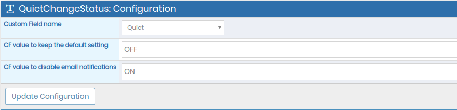
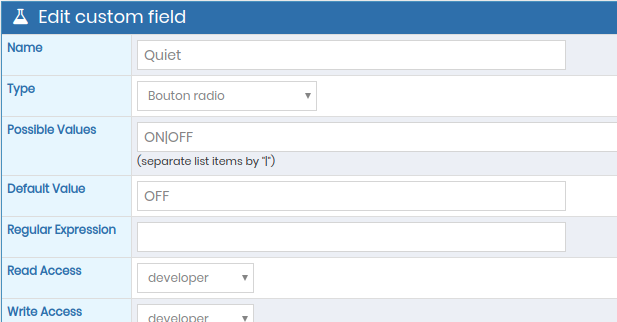

# Quiet Change Status plugin for MantisBT

Copyright (c) 2020 Association Cocktail, Marc-Antoine TURBET-DELOF

## Description

_QuietChangeStatus_ is a plugin for [MantisBT](http://mantisbt.org) that 
allows to disable temporarily email notifications with a Custom Field setting.

## Installation

### Requirements

The plugin requires [MantisBT 2.24](https://github.com/mantisbt/mantisbt/tree/release-2.24.0) (not tested on earlier releases).

To be used, the plugin require a Custom Field, with 2 values, active on project.

### Setup Instructions

1. Download or clone a copy of the 
   [plugin's code](https://github.com/Association-Cocktail/QuietChangeStatus).
2. Copy the plugin (the `QuietChangeStatus/` directory) into your Mantis
   installation's `plugins/` directory.
3. While logged in as an administrator, go to *Manage → Manage Plugins*.
4. In the *Available Plugins* list, you'll find the *QuietChangeStatus* plugin;
   click the **Install** link.
5. Create a Custom Field on choosen projects, with a toggled 2 values.
6. In the *Installed Plugins* list, click on the **QuietChangeStatus** plugin to configure it.
7. As set in the Custom Filed settings, users can choose to temporary disable email notification.

## Configuration

The Custom Field can be selected on the plugin's config page.

Specify, for each comportement, the Custom field value.

A bad configuration (ex. inexistant value) do not modify the email notification configuration.

## Screen Shots

In the plugin config page *Manage → Manage Plugins → QuietChangeStatus*

## Support

If you wish to file a
[bug report](https://github.com/Association-Cocktail/QuietChangeStatus/issues/new),
or have questions related to use and installation, please use the plugin's
[issues tracker](https://github.com/Association-Cocktail/QuietChangeStatus/issues)
on GitHub.

All code contributions (bug fixes, new features and enhancements, translations) 
are welcome and highly encouraged, preferably as a
[Pull Request](https://github.com/Association-Cocktail/QuietChangeStatus/compare).

The latest source code is available on
[GitHub](https://github.com/Association-Cocktail/QuietChangeStatus).
